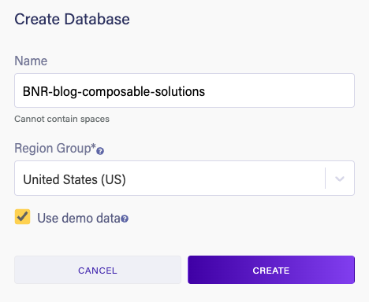
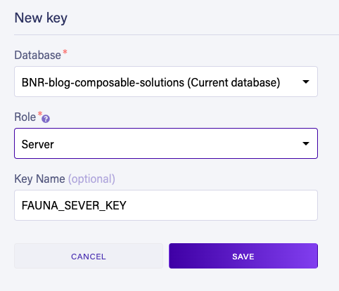
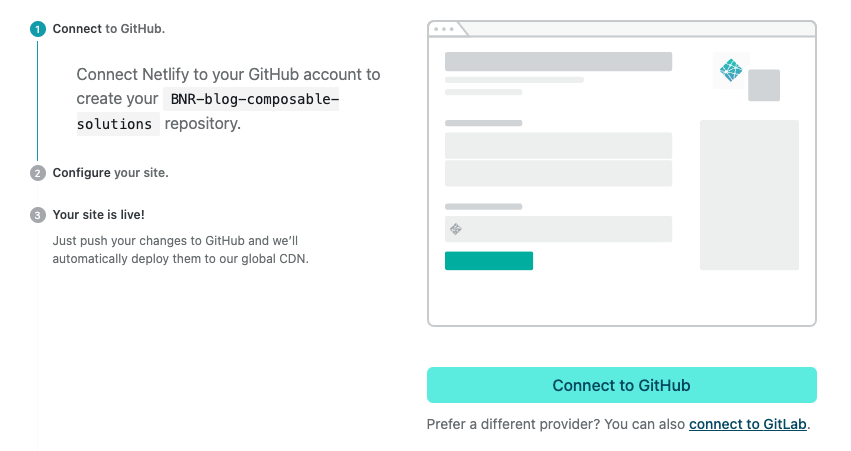
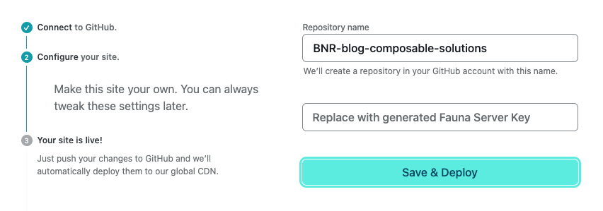
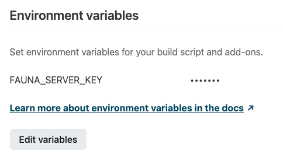
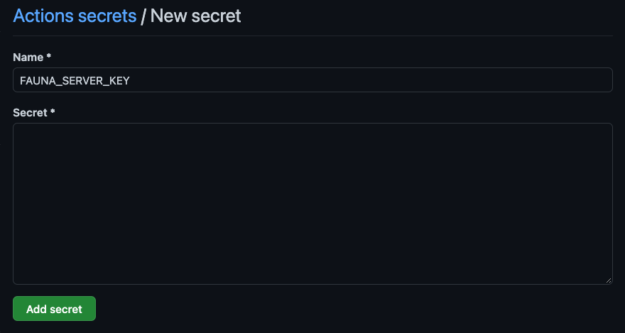
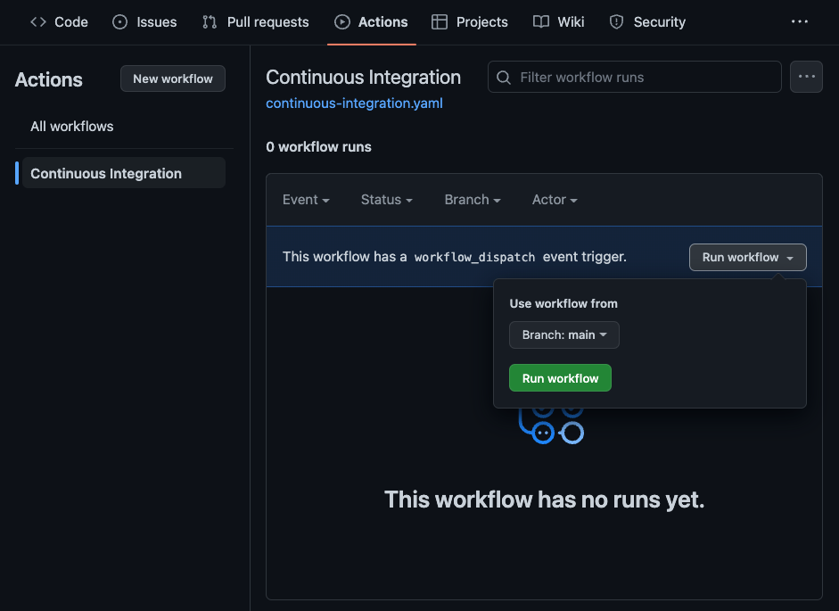

This is a starter repository uses Netlify, Fauna, GitHub Actions, Stencil, and a local shared module as an example composable solution to build from.

# TL;DR

You'll need Fauna and Netlify accounts, a Fauna database created with sample data, and a Fauna Server Key for your database.

If you have all that ready, then click the deploy to Netlify button below:

# Demo Site

You can find a demo of this starter repository at [https://bnr-blog-composable-solutions.netlify.app/](https://bnr-blog-composable-solutions.netlify.app/).
Follow the instruction in the Getting Started section below to deploy your own copy of this demo site.

# Getting Started

Follow these step-by-step instructions to create a Fauna database with sample data, generate a Fauna Server Key, and configure an Environment Variable in Netlify with your Fauna Server Key.
At the end of this process you'll have your own copy of this repository deployed to Netlify and reading from your own Fauna database.

## Fauna

1. Sign up for a free [Fauna Account](https://dashboard.fauna.com/accounts/register).
2. Create a new Fauna Database from the [Fauna Dashboard](https://dashboard.fauna.com/) giving it a name, selecting a region, and checking the box for `Use demo data`.

   

3. Navigate into your new database and to the `Security` section using the navigation on the left side.
4. From the `Security > Keys` page click `New Key` to generate a new Fauna Server Key.

   

5. The Fauna Server Key will be displayed and you will need this value in the next section so keep this page open or copy it somewhere safe.

   

## Netlify

1. Sign up for a free [Netlify Account](https://app.netlify.com/signup).
2. Initiate the [Deploy to Netlify](https://app.netlify.com/start/deploy?repository=https://github.com/BNR-Developer-Sandbox/BNR-blog-composable-solutions) of this starter repository.
3. On Netlify, click `Connect to GitHub` and grant any authorizations needed.

   

4. Configure your site by entering your Fauna Server Key generated in the previous section in the field labeled `Replace with generated Fauna Server Key`.

   

5. Click `Save & Deploy`
6. Netlify will build and deploy your new Netlify Site with a custom subdomain under `netlify.app`.
7. In Netlify, navigate to `Site settings > Build & deploy > Environment > Environment variables` to find where your `FAUNA_SERVER_KEY` was saved.

   

## GitHub Actions

Your repository must be hosted on GitHub in order to use [GitHub Actions](https://docs.github.com/en/actions).
GitHub looks for GitHub Actions workflows in the `.github/workflows/` directory.

1. Go to GitHub and find your new repository.
2. Navigate to the `Settings` tab.
3. Expand the `Secrets` options from the left side menu.
4. Click `Actions` to navigate to the `Actions secrets` page.
5. Click `New repository secret` to create new secret.

   

6. Enter `FAUNA_SERVER_KEY` as the secret name, enter your Fauna Server Key in the secret field, and click `Add secret`.
7. You will now see your new repository secret listed on the `Action secrets` page.

   

8. Navigate to the `Actions` tab to view all workflows.
9. Click on the `Continuous Integration` workflow in the left side navigation to go to the Continuous Integrations workflow page.
10. Expand the `Run workflow` dropdown and click the `Run workflow` button.

    

11. Your workflow run will be queued and begin running. Click through to view details on the GitHub actions job run.

# Local Development

1. Install dependencies with `npm install`
2. Login to Netlify with `npx netlify login`
3. Link your Netlify Site `npx netlify link`
4. Start the local development server `npm start`

## Netlify

[Netlify Dev](https://cli.netlify.com/netlify-dev/) is used to start the local development server which will inject Netlify Environment Variables from your linked Netlify Site and start the Stencil development server.
[Netlify Functions](https://docs.netlify.com/functions/build/?fn-language=js) are defined in the `api/` directory as configured in `netlify.toml`.

## Stencil

[Stencil](https://stenciljs.com/docs/introduction) is a compiler for Web Components / Custom Elements.
Stencil can be used to create a component library or an application.
This starter repository is a Stencil application.

The interoperability of Custom Elements with other web frameworks is documented and tested on [Custom Elements Everywhere](https://custom-elements-everywhere.com/).

## Local Shared Module

There is a local shared module called `core` in the `core/` directory at the root of this repository.
Notice that `core` is installed as a dependency in `package.json` using `"core": "file:./core"` to reference the local file path.
This `core` module is also installed in the `.github/workflows/package.json` and `api/` directories.
Search the code base for [import core from 'core/index.js'](https://github.com/BNR-Developer-Sandbox/BNR-blog-composable-solutions/search?q=import+core+from+core%2Findex.js) to see how this module is being using in GitHub Actions (`.github/workflows`), Netlify Functions (`api/`), and Stencil (`src/`).

# Scaffolding

Wondering how this starter repository was created?
The following subsections briefly describe how this starter repository was scaffolded using the Stencil CLI and the Netlify CLI with links to further documentation.

## Stencil Initialization

[Stencil: Getting Started - Starting a new project](https://stenciljs.com/docs/getting-started)

The Stencil application was initialized using `npm init stencil` and selecting the `ionic-pwa` starter.

## Netlify CLI Installation

[Netilfy CLI: Getting Started - Installation in a CI environment](https://docs.netlify.com/cli/get-started/#automated-setup)

The Netlify CLI was installed locally using `npm install netlify-cli --save-dev`.

## Netilfy CLI Initialization

[Netilfy CLI: Getting Started - Automated setup](https://docs.netlify.com/cli/get-started/#automated-setup)

The Netlify configuration was initialized using `npx netlify-cli init`.
